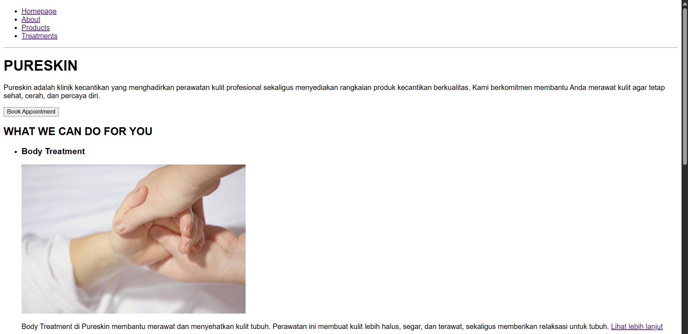
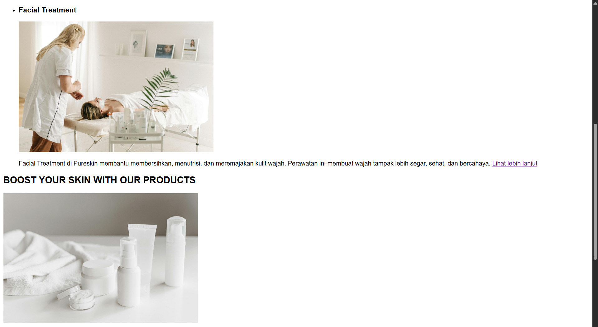
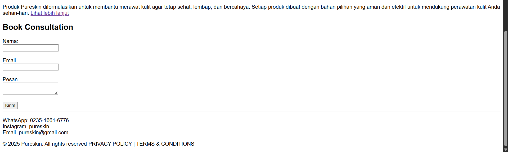
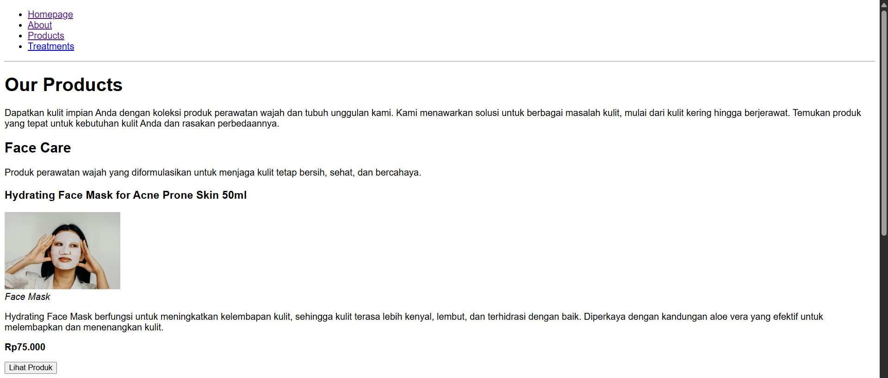
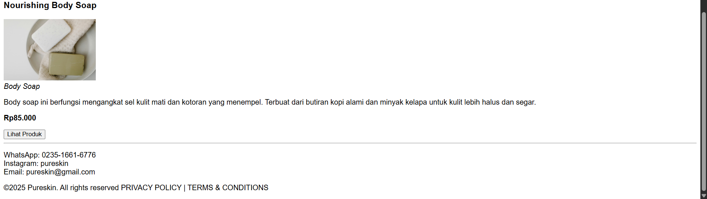
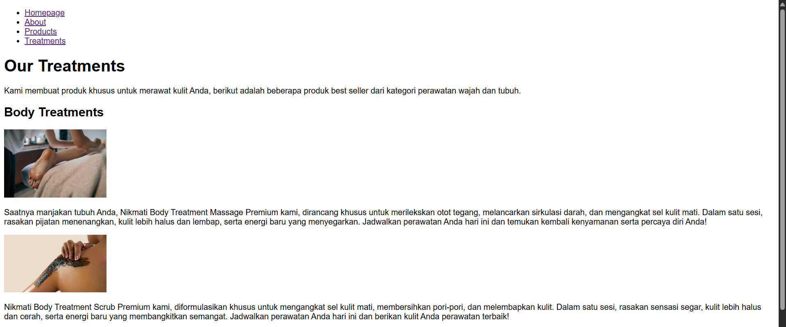
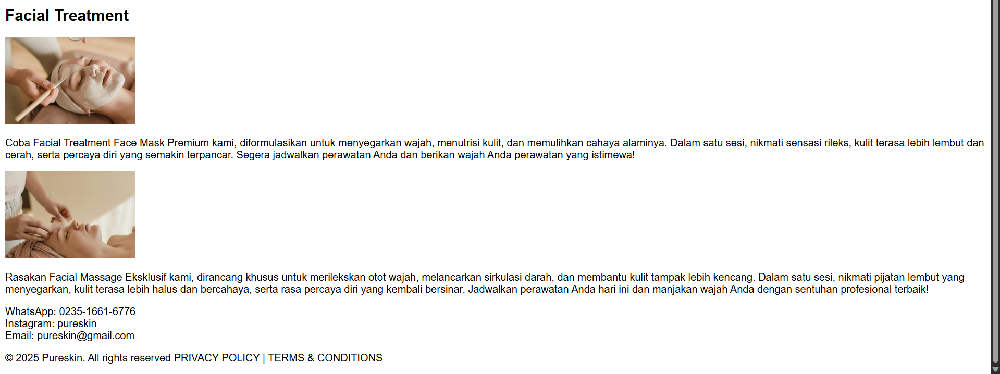

# Pureskin Website – HTML Semantic Layout

Proyek ini merupakan tugas kelompok pada mata kuliah **Pemrograman Web** yang berfokus pada pembuatan layout website menggunakan **HTML** dan **HTML Semantik** tanpa bantuan CSS maupun JavaScript.  
Website yang kami buat bernama **Pureskin**, yaitu sebuah website klinik kecantikan yang juga menyediakan produk perawatan kulit.

---

## 📌 Tujuan
- Melatih kemampuan membuat struktur halaman web dengan HTML5.
- Menggunakan elemen semantik seperti `<header>`, `<nav>`, `<main>`, `<article>`, `<aside>`, dan `<footer>`.
- Membuat layout website yang rapi, logis, dan mudah dipahami.

---

## 👩‍💻 Anggota Kelompok
- **Ni Luh Risma Putri Wirdianthi** (42430001)  
- **Benedito Nidio Da Rosa Maia Tilman** (42430032)  
- **Salsabila Nur Shafa** (42430040)  
- **Renald Kevin Azzaky** (42430029)  

Dosen Pengampu: *Ir. Gede Humaswara Prathama, S.T., M.T*  
Program Studi Teknologi Informasi, Fakultas Teknik dan Informatika, Universitas Pendidikan Nasional – 2025.

---

## 🌐 Tema Website
Pureskin adalah klinik kecantikan yang menyediakan:  
- **Facial Treatment**  
- **Body Treatment**  
- **Produk Skincare** (pembersih wajah, pelembap, serum, dll.)  
- **Booking Consultation** untuk reservasi online  

Website ini dirancang agar informasi tentang layanan, produk, dan kontak dapat diakses dengan mudah dan terstruktur.

---

## 📄 Struktur Halaman

### 1. Homepage (`Homepage.html`)
Halaman utama yang menampilkan gambaran umum Pureskin, termasuk layanan, produk unggulan, serta tombol **Book Appointment**.  

**Penjelasan:**
- Bagian atas berisi navigasi (`<nav>`) dengan link ke semua halaman.  
- `<header>` berisi judul besar "Pureskin" dan tombol *Book Appointment*.  
- `<main>` terbagi menjadi 3 section:  
  - **Layanan (Treatments)**: Body & Facial Treatment.  
  - **Produk**: Menampilkan produk skincare.  
  - **Form Booking**: Formulir untuk konsultasi.  
- `<footer>` berisi kontak dan hak cipta.  

---

### 2. About Us (`AboutUs.html`)
Halaman tentang Pureskin, berisi sejarah singkat, visi misi, dan kontak.  

**Penjelasan:**
- `<main>` berisi judul **About Us** dan deskripsi singkat tentang Pureskin.  
- Menampilkan gambar representatif klinik.  
- Bagian bawah ada section **Contact Us** dengan form sederhana.  

---

### 3. Our Products (`OurProducts.html`)
Halaman khusus untuk daftar produk skincare Pureskin.  

**Penjelasan:**
- `<header>` menampilkan judul halaman dan deskripsi singkat.  
- Isi halaman dapat menampilkan list produk berupa nama, deskripsi, dan harga (masih berupa teks dasar di versi HTML ini).  

---

### 4. Our Treatments (`OurTreatments.html`)
Halaman khusus untuk daftar layanan treatment.  

**Penjelasan:**
- `<header>` berisi judul "Our Treatments".  
- Konten berisi deskripsi layanan facial treatment dan body treatment.  
- Dapat diperluas dengan form booking khusus treatment.  

---

## ⚙️ Teknologi yang Digunakan
- **HTML5** (full semantic structure)
- **Tanpa CSS & JavaScript** (fokus hanya pada struktur semantik)

---

## 📂 Struktur Folder

`Homepage.html`

## Tag yang digunakan

1. `<!DOCTYPE html>`  
   Bagian ini digunakan untuk mendefinisikan bahwa dokumen menggunakan HTML5, dan berfungsi agar browser tahu jika kita memakai HTML5.

2. `<html lang="en">`  
   Bagian ini merupakan elemen utama HTML. Atribut `lang="en"` menunjukkan bahasa dokumen adalah bahasa Inggris. Bagian ini merupakan pembungkus utama semua kode HTML. `lang="en"` artinya bahasa halaman ini Inggris.

3. `<head>`  
   Bagian merupakan bagian kepala dokumen dan berisi informasi untuk browser, tetapi tidak tampil di halaman utama.

4. `<meta charset="UTF-8">`  
   Bagian ini berfungsi untuk menentukan karakter encoding halaman agar semua huruf dan simbol bisa tampil dengan benar, dan berfungsi agar huruf, angka, dan simbol bisa tampil dengan benar (termasuk karakter non-Inggris).

5. `<meta name="viewport" content="width=device-width, initial-scale=1.0">`  
   Bagian ini berfungsi untuk mengatur halaman agar responsif di perangkat mobile, menyesuaikan dengan lebar layar, dan berfungsi agar halaman web otomatis menyesuaikan ukuran layar (responsif di HP & laptop).

6. `<title>Pureskin</title>`  
   Bagian ini digunakan untuk menentukan judul halaman yang muncul di tab browser.

7. `</head>`  
   Bagian ini merupakan penutup bagian kepala dokumen.

---

## Tag yang digunakan

1. `<body>`  
   Karena semua konten utama website (teks, gambar, menu, form) ditampilkan di sini, jadi bagian ini yang benar-benar terlihat di browser.

2. `<!-- Navbar -->`  
   Digunakan sebagai tempat untuk memberikan catatan di dalam kode, berfungsi agar developer tahu bagian ini adalah navigasi, bagian ini tidak akan tampil di browser.

3. `<nav>...</nav>`  
   Berfungsi untuk menunjukan bahwa ini adalah menu navigasi utama dan juga membantu pembaca kode dan juga mesin pencari (SEO).

4. `<ul>...</ul>`  
   Karena menu navigasi biasanya berupa daftar. `<ul>` digunakan untuk membuat daftar tanpa angka (unordered list).

5. `<li>...</li>`  
   Digunakan untuk setiap item menu di navigasi, jadi setiap menu (Homepage, About Us, dll) ditempatkan di dalam `<li>`.

6. `<a href="..."> ... </a>`  
   Digunakan agar setiap item menu bisa diklik dan menuju ke halaman lain. `href` menunjukkan ke mana link tersebut akan pergi.  
   - `Homepage.html` → untuk ke halaman utama  
   - `AboutUs.html` → untuk ke halaman tentang  
   - `OurProducts.html` → untuk ke halaman produk  
   - `OurTreatments.html` → untuk ke halaman treatment  

7. `
`  
   Digunakan agar ada garis pemisah antar bagian halaman sehingga halaman menjadi lebih rapi dan mudah dibaca.

8. `</body>`  
   Digunakan sebagai penutup bagian utama halaman. Semua konten harus berada di dalamnya.

---

## Tag yang digunakan

1. `<body>`  
   Karena semua konten website yang ingin ditampilkan ke user harus ada di sini. Tanpa `<body>`, halaman akan kosong.

2. `<!-- Main -->`  
   Digunakan untuk memberikan catatan sehingga kode program menjadi lebih rapi dan mudah dibaca oleh developer. Komentar ini membantu mengenali bagian "Main" tanpa memengaruhi tampilan.

3. `<main>`  
   Dipakai agar jelas mana konten utama di halaman. Berguna untuk pembaca kode, mesin pencari, dan aksesibilitas.

4. `<section>...</section>`  
   Digunakan agar mudah untuk mengelompokkan konten menjadi satu bagian tertentu. Di sini bagian layanan dipisahkan agar lebih terstruktur.

5. `<h2>...</h2>`  
   Digunakan agar ada judul besar yang menjelaskan isi section dan membuat user langsung tahu topik utamanya.  
   Contoh: "WHAT WE CAN DO FOR YOU".

6. `<aside>...</aside>`  
   Dipakai untuk menaruh konten pendukung/sampingan yang dalam hal ini termasuk daftar layanan yang ditampilkan sebagai pelengkap dari judul utama.

7. `<ul>...</ul>`  
   Karena daftar layanan lebih cocok ditampilkan sebagai list dan `<ul>` akan buat tampilan menjadi lebih rapi dan teratur.

8. `<li>...</li>`  
   Digunakan agar setiap layanan bisa dipisah satu per satu dan memudahkan pembacaan serta styling dengan CSS.

9. `<h3>...</h3>`  
   Digunakan untuk sub-judul tiap layanan, sehingga user bisa langsung tahu nama layanannya sebelum baca deskripsi.

10. ``  
    Digunakan untuk menampilkan gambar layanan dan menambahkan visualisasi terhadap isi konten.  
    - `src` → ambil gambar dari lokasi file.  
    - `alt` → jaga-jaga kalau gambar gagal dimuat, tetap ada teks pengganti.  
    - `width` → digunakan untuk mengatur ukuran gambar agar konsisten.

11. `
...
`  
    Digunakan agar ada penjelasan singkat dalam bentuk paragraf sehingga user lebih paham tentang layanan yang ditawarkan.

12. `<a href="..."> ... </a>`  
    Digunakan agar user bisa klik dan masuk ke halaman detail layanan. Contoh: link ke `OurTreatments.html`.

13. `</main>`  
    Berfungsi sebagai penutup bagian utama konten, biar strukturnya jelas dan tidak bercampur dengan elemen lain.

14. `</body>`  
    Berfungsi sebagai penutup bagian utama halaman web. Semua yang tampil di browser sudah selesai ditulis di dalamnya.

---

## Tag yang digunakan

1. `<section>`  
   Bagian ini digunakan agar bagian produk terpisah dan rapi, sehingga terlihat lebih jelas kalau ini khusus untuk menampilkan informasi produk.

2. `<h2>...</h2>`  
   Berfungsi agar ada judul besar yang langsung memberi tahu user topik utamanya.  
   Contoh: "BOOST YOUR SKIN WITH OUR PRODUCTS".

3. ``  
   Digunakan agar produk bisa dilihat dengan gambar, bukan cuma teks.  
   - `src` → ambil gambar produk dari folder/file.  
   - `alt` → kalau gambar gagal dimuat, tetap ada teks pengganti.  
   - `width` → digunakan untuk mengatur ukuran gambar agar tampilannya konsisten.

4. `
...
`  
   Digunakan untuk menjelaskan gambaran umum mengenai produk yang disediakan.

5. `<a href="..."> ... </a>`  
   Berfungsi agar user bisa klik dan masuk ke halaman detail produk.  
   Contoh: link ke `OurProducts.html`.

6. `</section>`  
   Sebagai penutup bagian produk agar strukturnya jelas dan tidak tercampur dengan bagian lain.

---

## Tag yang digunakan

1. `<main>`  
   Digunakan agar jelas mana konten utama di halaman, semua bagian penting ada disini.

2. `<section id="book-consultation">`  
   Digunakan agar bagian form konsultasi terpisah dari konten lain.  
   `id="book-consultation"` digunakan agar memudahkan saat akan di-style dengan CSS atau dijadikan target link.

3. `<h2>...</h2>`  
   Digunakan untuk memberikan judul besar pada section ini, agar user langsung tahu ini adalah bagian "konsultasi".  
   Contoh: "Book Consultation".

4. `<form>`  
   Digunakan sebagai wadah utama untuk semua input pengguna. Semua isian (nama, email, pesan) ada di dalam tag ini.

5. `<label for="..."> ... </label>`  
   Berfungsi agar user tahu input ini untuk apa.  
   Atribut `for` dihubungkan ke `id` input, sehingga form lebih ramah untuk aksesibilitas (misalnya screen reader).  
   - `for="nama"` → label untuk input nama  
   - `for="email"` → label untuk input email  
   - `for="pesan"` → label untuk textarea pesan  

6. `<input type="text" id="nama" name="nama">`  
   Untuk isian nama.  
   `type="text"` → menerima teks biasa.

7. `<input type="email" id="email" name="email">`  
   Untuk isian email.  
   `type="email"` → otomatis memvalidasi format email (misalnya harus ada @).

8. `<textarea id="pesan" name="pesan"></textarea>`  
   Dipakai pada saat user perlu menulis pesan panjang dan lebih fleksibel daripada input teks biasa.

9. ` `  
   Digunakan agar tampilan lebih rapi, dan setiap input selanjutnya akan turun ke baris baru.

10. `<button type="submit">Kirim</button>`  
    Tombol untuk kirim form.  
    `type="submit"` artinya saat diklik, form akan dikirim ke server/aksi yang ditentukan.

11. `</form>`  
    Merupakan bagian penutup form dan semua input harus ada di dalamnya.

12. `</section>`  
    Merupakan bagian penutup bagian konsultasi sehingga konten tetap terstruktur rapi.

13. `</main>`  
    Merupakan bagian penutup konten utama halaman.

14. `
`  
    Digunakan agar ada garis pemisah, sehingga halaman lebih teratur dan bagian antar konten jelas.

---

## Tag yang digunakan

1. `<footer>`  
   Dipakai untuk bagian bawah halaman web. Bagian ini akan berisi info penting seperti kontak, hak cipta, dan link kebijakan. Dengan tag ini, struktur halaman menjadi lebih jelas dan profesional.

2. `
...
`  
   Digunakan untuk menampilkan teks dalam bentuk paragraf.  
   Di sini dipakai untuk membungkus informasi kontak. 

3. `<li>...</li>`  
   Digunakan agar setiap informasi kontak (WhatsApp, Instagram, Email) bisa tampil rapi sebagai item terpisah sehingga memudahkan user membaca informasi.

4. `&copy;`  
   Merupakan Entity HTML khusus yang pada program ini digunakan untuk menampilkan simbol hak cipta (©).  
   Keuntungan dari penggunaan entity ini: akan tampil konsisten di semua browser.

5. `
&copy; 2025 Pureskin. All rights reserved PRIVACY POLICY | TERMS & CONDITIONS
`  
   Bagian ini akan memberikan info hak cipta sekaligus link ke kebijakan privasi dan syarat ketentuan, sehingga user tahu website ini resmi dan ada aturan jelasnya.

6. `</footer>`  
   Penutup dari bagian footer. Dengan ini, user paham kalau halaman sudah sampai bagian akhir.

---

`AboutUs.html`

## Tag yang digunakan

1. `<body>`  
   Digunakan untuk membungkus seluruh konten utama dari halaman web. Semua elemen yang akan ditampilkan ke pengguna berada di dalam tag ini, karena tanpa `<body>`, browser tidak tahu bagian mana yang harus ditampilkan

2. `<main>`  
   Digunakan untuk menandai bagian konten utama dari sebuah halaman web.  
   Membantu SEO dan screen reader memahami bagian inti dari halaman, sehingga lebih semantik.

3. `<header>`  
   Digunakan untuk membungkus elemen pengantar halaman.  
   Pada kode ini, `<header>` menampilkan bagian "About Us" sebagai identitas atau judul section.

4. `<h1>`  
   Tag heading terbesar yang digunakan untuk judul utama.  
   Di sini dipakai untuk menampilkan teks **"About Us"** agar jelas bahwa halaman ini adalah bagian tentang perusahaan dan juga penting untuk SEO dan hierarki konten.

5. `<section>`  
   Digunakan untuk mengelompokkan konten yang saling berhubungan.  
   Pada kode ini, `<section>` dipakai untuk membungkus keseluruhan deskripsi perusahaan (visi, cerita awal, perjalanan brand).

6. `
`  
   Digunakan untuk menampilkan teks dalam bentuk paragraf.  
   - `<p1>` berisi penjelasan visi/misi brand.  
   - `<p2>` berisi cerita awal perjalanan brand.  
   - `<p3>` berisi perkembangan dan pencapaian brand.  
   Dengan `
`, teks lebih rapi, mudah dibaca, dan terstruktur.

7. ` `  
   Digunakan untuk membuat jarak atau pindah baris antar paragraf.  
   Pada program ini, kode ini dipakai untuk memberi spasi tambahan di antara paragraf. Namun, lebih baik menggunakan CSS untuk mengatur jarak agar lebih fleksibel.

8. `</...>` (closing tag)  
   Hampir semua elemen memiliki penutup seperti `</main>`, `</header>`, `</section>`, `
`.  
   Penutup tag penting agar struktur dokumen jelas, tidak error, dan mudah dipahami browser.

---

## Tag yang digunakan

1. `<main>`  
   Digunakan untuk menandai konten utama halaman web. Semua isi penting (gambar, teks, dan form kontak) ditempatkan di dalamnya sehingga memudahkan pembaca maupun mesin pencari mengenali bagian inti halaman.

2. `<section>`  
   Berfungsi untuk mengelompokkan bagian tertentu dari halaman. Di sini digunakan untuk membungkus bagian **Contact Us**, sehingga lebih terstruktur dan mudah dipahami.

3. ``  
   Dipakai untuk menampilkan gambar. Pada kode ini, gambar facial massage ditampilkan dengan atribut `alt` (teks alternatif jika gambar gagal muncul) dan `width="300"` agar ukurannya tidak terlalu besar.  

4. `<h2>`  
   Heading tingkat 2, digunakan untuk judul bagian. Di sini dipakai untuk judul "Contact Us", sehingga user langsung tahu topik yang sedang ditampilkan.

5. `
`  
   Digunakan untuk membuat paragraf teks. Dalam kode ini dipakai untuk memberi informasi singkat kepada user agar mengisi form jika ada pertanyaan, saran, atau kritik.

6. `<form>`  
   Tag ini digunakan untuk membuat formulir agar user bisa mengirimkan data (nama, email, pesan). Semua elemen input dimasukkan di dalam `<form>`.

7. `<label>`  
   Digunakan untuk memberikan keterangan pada setiap input form. Misalnya "Nama", "Email", dan "Pesan".  
   Atribut `for` menghubungkan label dengan input/textarea berdasarkan `id`, sehingga meningkatkan aksesibilitas (misalnya saat user klik label, otomatis fokus ke input).

8. `<input>`  
   Tag untuk menerima data dari user.  
   - `type="text"` → untuk input teks biasa (nama).  
   - `type="email"` → khusus untuk email, browser otomatis bisa memberi validasi jika format email salah.  
   Atribut `id` dan `name` digunakan untuk identifikasi input ini saat data dikirim.

9. `<textarea>`  
   Digunakan untuk input teks panjang (pesan user). Berbeda dengan `<input>`, tag ini bisa menampung beberapa baris teks.

10. `<button>`  
    Digunakan untuk membuat tombol.  
    - `type="submit"` artinya tombol ini berfungsi mengirimkan isi form ke server.  
    - Tulisan **Kirim** ditampilkan di tombol agar user tahu fungsinya.

11. ` `  
    Tag untuk membuat baris baru. Di sini digunakan agar tampilan form lebih rapi (setiap label dan input ditampilkan di baris berbeda).

12. `
`  
    Digunakan untuk menampilkan garis horizontal sebagai pemisah antar bagian konten halaman.  

13. `</body>`  
    Penutup dari seluruh isi halaman web yang ditampilkan ke user.

---

`OurProducts.html`

## Tag yang digunakan

1. `<body>`  
   Digunakan untuk membungkus seluruh konten utama dari halaman web. Semua elemen yang akan ditampilkan ke pengguna berada di dalam tag ini, karena tanpa <body>, browser tidak tahu bagian mana yang harus ditampilkan

2. `<!-- ... -->`  
   Digunakan agar kode lebih rapi dan mudah dibaca oleh developer dan bagian komentar ini juga membantu mengenali bagian tertentu (contoh: `<!-- Main -->`, `<!-- Face Care -->`).

3. `<main>`  
   Digunakan agar jelas mana konten utama di halaman dan juga berguna untuk pembaca kode, mesin pencari (SEO), dan aksesibilitas.

4. `<header>`  
   Digunakan untuk menaruh judul utama dan deskripsi awal halaman dan tag ini memisahkan bagian pembuka dari isi konten produk.

5. `<h1>`  
   Digunakan agar ada judul besar yang menjelaskan isi halaman dan membuat user langsung tahu topik utama halaman, yaitu "Our Products".

6. `
`  
   Digunakan untuk menjelaskan informasi detail tentang produk dan manfaatnya, digunakan juga untuk memberikan deskripsi dari h1 "Our Products" agar lebih jelas untuk user.

7. `<section>`  
   Digunakan untuk mengelompokkan konten jadi satu bagian tertentu. 

8. `<h2>`  
   Digunakan agar ada subjudul yang menjelaskan tiap kategori dan membantu user untuk mengetahui produk yang ditampilkan termasuk bagian "Face Care".

9. `<h3>`  
   Digunakan untuk nama produk spesifik. Dengan penggunaan heading ini, struktur heading akan menjadi lebih jelas: halaman (h1) → kategori (h2) → produk (h3).

10. ``  
   Digunakan untuk menampilkan gambar produk agar lebih menarik secara visual. Atribut `alt` dipakai untuk aksesibilitas & SEO, `width` mengatur ukuran gambar.

11. ` `  
   Digunakan untuk membuat baris baru, sehingga teks lebih rapi tanpa perlu memulai paragraf baru.

12. `<em>`  
   Digunakan untuk memberikan penekanan (italic) pada teks, contohnya nama produk. Sehingga akan membuat teks lebih bervariasi tampilannya.

13. `<strong>`  
   Digunakan agar teks terlihat tebal dan digunakan juga untuk menegaskan harga agar terlihat lebih menonjol.

14. `<button>`  
   Digunakan untuk memberikan interaksi ke user, contohnya tombol "Lihat Produk". 

15. `
`  
   Digunakan untuk membuat garis pemisah antar bagian produk dan untuk memisahkan visual antar kategori sehingga tampilan lebih rapi.

---

## Tag yang digunakan

1. `<body>`  
   Digunakan untuk membungkus seluruh konten utama dari halaman web. Semua elemen yang akan ditampilkan ke pengguna berada di dalam tag ini, karena tanpa , browser tidak tahu bagian mana yang harus ditampilkan.

2. `<!-- ... -->`  
   Digunakan agar kode lebih rapi dan mudah dibaca oleh developer dan bagian komentar ini juga membantu mengenali bagian tertentu (contoh: <!-- Main -->, <!-- Body Care -->)..

3. `<main>`  
   Digunakan agar jelas mana konten utama di halaman dan juga berguna untuk pembaca kode, mesin pencari (SEO), dan aksesibilitas.

4. `<section>`  
   Digunakan untuk mengelompokkan produk jadi satu bagian kategori. Dengan ini, struktur kode lebih rapi dan mudah dipahami.

5. `<h2>`  
   Subjudul dipakai untuk menandai nama produk tertentu. Dengan hierarki ini, user tahu urutan produk lebih jelas.

6. `<h3>`  
   Digunakan untuk nama produk spesifik. Dengan penggunaan heading ini, struktur heading akan menjadi lebih jelas: halaman (h1) → kategori (h2) → produk (h3).

7. ``  
   Digunakan untuk menampilkan gambar produk Body Care. Atribut `alt` dipakai untuk aksesibilitas, `width` mengatur ukuran supaya konsisten.

8. `
`  
   Digunakan untuk memberikan deskripsi tentang produk dan membuat user paham fungsi atau manfaat produk tanpa harus melihat detail lain.

9. ` `  
   Digunakan untuk membuat baris baru, sehingga teks lebih rapi tanpa perlu memulai paragraf baru.

10. `<em>`  
   Digunakan untuk memberikan penekanan (italic) pada teks, contohnya nama produk. Sehingga akan membuat teks lebih bervariasi tampilannya.

11. `<strong>`  
   Dipakai agar harga produk lebih menonjol dan membantu user langsung menangkap informasi penting.

12. `<button>`  
   Digunakan untuk memberi interaksi berupa aksi seperti "Lihat Produk". Elemen ini menambah fungsi praktis pada halaman.

13. `
`  
   Digunakan sebagai garis pemisah antar produk dan memmbuat tampilan halaman lebih rapi dan memisahkan tiap item dengan jelas.

---

`OurTreatments.html`

## Tag yang digunakan

1. `<body>`  
   Digunakan untuk membungkus seluruh konten utama dari halaman web. Semua elemen yang akan ditampilkan ke pengguna berada di dalam tag ini, karena tanpa , browser tidak tahu bagian mana yang harus ditampilkan.

2. `<!-- ... -->`  
   Digunakan agar kode lebih rapi dan mudah dibaca oleh developer dan bagian komentar ini juga membantu mengenali bagian tertentu (contoh: <!-- Our Treatments -->).

3. `<main>`  
   Digunakan agar jelas mana konten utama di halaman dan juga berguna untuk pembaca kode, mesin pencari (SEO), dan aksesibilitas.

4. `<header>`  
   Digunakan untuk menaruh judul utama dan deskripsi awal halaman dan tag ini memisahkan bagian pembuka dari isi konten produk.

5. `<h1>`  
   Digunakan untuk memberikan keterangan heading utama yang langsung memberi tahu user bahwa halaman ini berisi "Our Treatments".

6. `
`  
   Digunakan untuk memberikan deskripsi tentang produk dan membuat user paham fungsi atau manfaat produk tanpa harus melihat detail lain.

5. `<section>`  
   Digunakan untuk mengelompokkan layanan jadi beberapa bagian tertentu. Dengan penggunaan bagian ini ini, setiap jenis layanan akan memiliki blok khusus.

6. `<h2>`  
   Digunakan untuk memberikan judul besar yang menjelaskan tiap section layanan dan membantu user tahu topik utama tiap bagian.

7. ``  
   Digunakan untuk menampilkan gambar layanan yang disediakan Pureskin. Atribut `alt` dipakai untuk aksesibilitas, `width` mengatur ukuran supaya konsisten.

---

## Tag yang digunakan

1. `<body>`  
   Digunakan sebagai tempat untuk semua konten utama yang akan tampil ada di sini. 

2. `<main>`  
   Digunakan untuk menandai konten utama halaman dan dalam hal ini, fokus pada layanan Facial Treatment.

4. `<section>`  
   Digunakan untuk mengelompokkan layanan facial ke dalam satu area khusus dan dengan menggunakan elemen semantic ini, kode program akan lebih terstruktur dan mudah dipisahkan dengan layanan lain.

5. `<h2>`  
   Dipakai untuk subjudul layanan, misalnya "Facial Treatment". 

6. ``  
   Digunakan untuk menampilkan gambar layanan yang disediakan Pureskin. Atribut `alt` dipakai untuk aksesibilitas, `width` mengatur ukuran supaya konsisten.

7. `
`  
   Digunakan untuk memberikan deskripsi singkat tiap layanan dan juga berguna untuk menjelaskan manfaat tanpa membuat tampilan terlalu penuh.

---

# Hasil Kode Program

`Homepage.html`

---
---

`AboutUs.html`

---
---

`OurProducts.html`

---
---

`OurTreatments.html`

---

